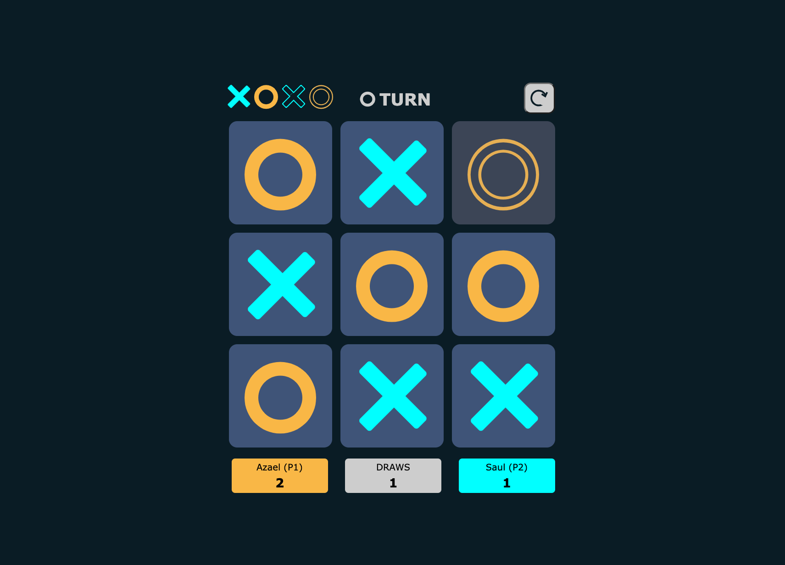

## Tic-Tac-Toe

A _Tic-Tac-Toe Game_ with **vanilla JavaScript, HTML, & CSS**.
🔗 **Live preview** of the project is [here](https://azaelreyes.github.io/tic-tac-toe-two/).

### Overview

#### **Features:**

- You can **play against another player**.
- Player 1 can **select a marker**.
- Each player can use a **custom name**.
- You can **restart the game** anytime.
- After each round the game resets and **keeps score of draws, and wins** for each player.

#### **Tools:**

- Visual Studio Code
- Linux terminal
- Git and GitHub
